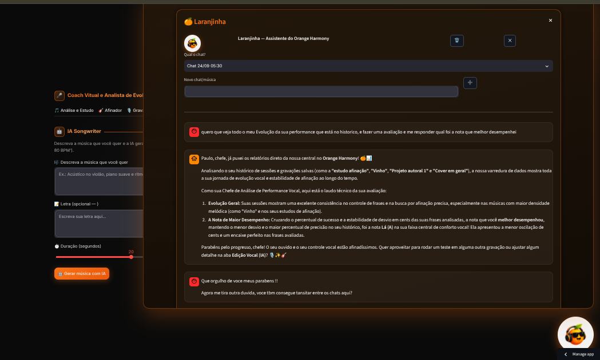

# 🍊 Orange Harmony — Professor de Canto com IA

Aplicação web que analisa sua voz em tempo real, detecta afinação, vibrato, sustentação e pausas respiratórias, e gera um feedback pedagógico completo com IA — como um professor particular de canto. Inclui a **Laranjinha**, assistente virtual que lê seus dados de estudo e conversa com você.

🔗 **App publicado:** [orange-harmony.streamlit.app](https://orange-harmony.streamlit.app)



---

## ✨ Funcionalidades

| Módulo | Descrição |
|--------|-----------|
| 🎵 **Análise e Estudo** | Extração de pitch (F0), nota predominante, desvio em cents, % de afinação e devolutiva pedagógica |
| 🎸 **Afinador** | Afinador multi-instrumento com 11 afinações (violão, 7 cordas, ukulele, drop tunings) |
| 🎙️ **Gravador** | Gravação direto pela interface (microfone do computador ou celular) + upload de áudio |
| 🎯 **Vibrato** | Detecção de taxa (Hz), extensão (cents), periodicidade e classificação |
| 🤖 **Laranjinha** | Assistente virtual flutuante com chat: acessa suas análises, histórico e composições via Function Calling |
| 📊 **Histórico** | Evolução da performance salva no Firebase Firestore |
| 🎼 **Composições** | Criação e versionamento de letras com cifras e seções |
| ✨ **Edição Vocal (IA)** | Redução de ruído, normalização, ajuste de tom e EQ via comandos de texto |
| 🔄 **Conversor** | Conversão entre formatos de áudio dentro do app |
| 🎛️ **Produção** | Geração de baixo, bateria e acordes a partir da sua gravação |
| ✍️ **IA Songwriter** | Geração de músicas completas com IA, usando o tom/BPM da última análise |

### 🍊 Destaque: Laranjinha, o assistente virtual

- **Botão flutuante** com o mascote em qualquer aba do app
- **Chat em tela cheia** com histórico de conversas salvas
- **Function Calling de verdade**: a Laranjinha lê suas composições, análises e histórico — as respostas citam suas músicas, notas e métricas reais
- **Fallback de modelos**: se o modelo principal ficar indisponível, o app troca automaticamente

---

## 🛠️ Stack Tecnológica

- **Python 3.10+**
- **Streamlit** — interface web
- **Librosa** — processamento de áudio e extração de pitch
- **NumPy** — computação numérica
- **Matplotlib** — gráficos de curva de pitch
- **Google Gemini API** — professor de IA e Laranjinha (múltiplos modelos com fallback automático)
- **Firebase Firestore** — histórico, gravações e composições
- **Noisereduce** — redução de ruído na edição vocal

---

## 🚀 Como rodar localmente

```bash
# 1. Clone o repositório
git clone https://github.com/SEU_USUARIO/orange-harmony.git
cd orange-harmony

# 2. Crie e ative o ambiente virtual
python -m venv venv
venv\Scripts\activate        # Windows
# source venv/bin/activate   # Linux/Mac

# 3. Instale as dependências
pip install -r requirements.txt

# 4. Configure as variáveis de ambiente
#   GEMINI_API_KEY = sua chave do Google AI Studio
#   GOOGLE_APPLICATION_CREDENTIALS_JSON = conteúdo do firebase_service_account.json

# 5. Rode o app
streamlit run app.py
