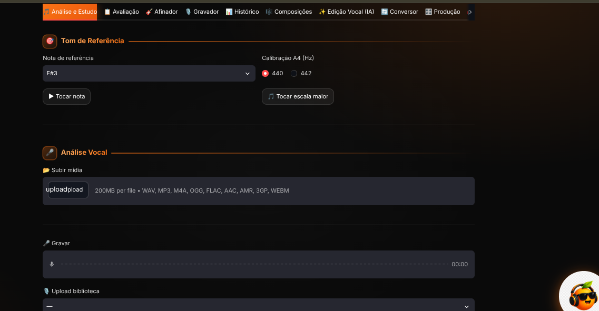
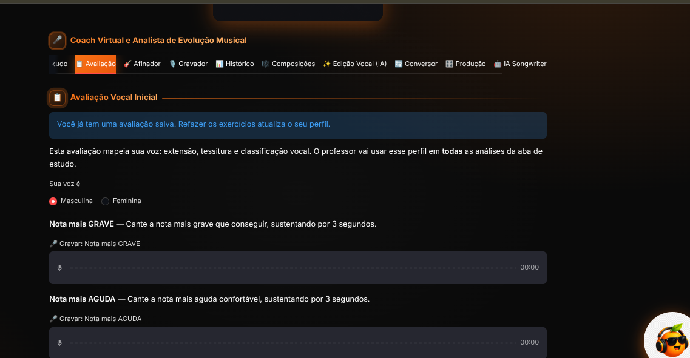
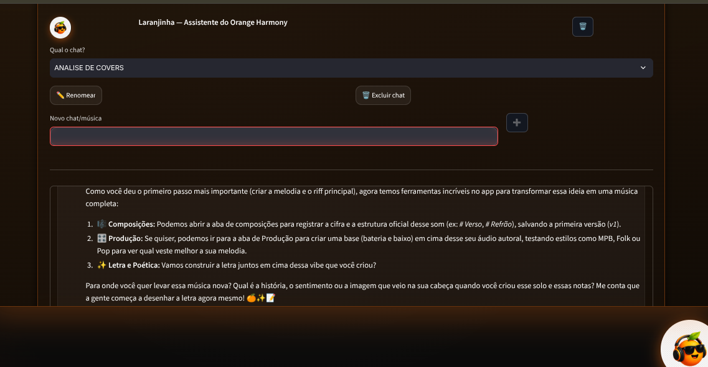

# 🍊 Orange Harmony

Assistente vocal inteligente que analisa sua voz, acompanha sua evolução e te ensina a cantar melhor — com professor de IA, avaliação vocal completa e assistente pessoal integrados.

## 🎯 O que é

O Orange Harmony é um app de coaching vocal que combina análise de áudio em tempo real (pitch, afinação, vibrato) com inteligência artificial. Ele conhece o seu perfil vocal, acompanha seu histórico e dá devolutivas de professor de canto — exigentes e baseadas em dados reais, não em elogios genéricos.

## ✨ Funcionalidades

### 🎵 Análise e Estudo
- **Análise completa**: nota predominante, desvio em cents, tendência, % de notas afinadas (±50c), frases sustentadas, pausas respiratórias e curva de pitch
- **Devolutiva do Professor (IA)**: parecer com pontos fortes, pontos a melhorar e exercício prático — com mentalidade de produtor musical, citando os dados da análise
- **Sequência melódica**: detecta as notas sustentadas cantadas e analisa as transições
- **Evolução**: o professor compara cada análise com o histórico recente e cobra problemas persistentes
- **Base da devolutiva**: escolha entre avaliar a voz natural (nota detectada) ou a aderência à nota de referência
- **Análise de Cover**: detecta tom, BPM, % de notas na escala e dá veredito com devolutiva
- **Detecção de vibrato**: taxa, extensão, deslize e classificação por nota sustentada

### 📋 Avaliação Vocal Inicial
Avaliação diagnóstica com 5 exercícios guiados (nota grave, aguda, confortável, glissando e frase natural) que gera seu **perfil vocal**: classificação (Baixo/Barítono/Tenor ou Contralto/Mezzo/Soprano), extensão em semitons e tessitura confortável. O perfil fica salvo no Firestore e é usado pelo professor e pela assistente em **todas** as análises.

### 🎸 Afinador
Afinador de violão/guitarra/voz com várias afinações (padrão, Drop D/C/B, meio tom abaixo, Open G/D/C, DADGAD, 7 cordas, ukulele), calibração A4 (440/442) e modo tempo real.

### 🎙️ Gravador
Grave ou envie áudios, nomeie e salve na nuvem. As gravações ficam disponíveis na Análise, na Produção e podem ser avaliadas pela assistente pelo nome.

### 📊 Histórico
Evolução da performance salva no Firebase, com tabela e gráfico de desvio médio e % afinado ao longo do tempo.

### 🎼 Composições
Crie e salve composições com cifras [Am], seções (# Verso, # Refrão) e versionamento (v1, v2...), com prévia, salvar e carregar.

### ✨ Edição Vocal (IA)
Ajuste a voz com comandos: redução de ruído, normalização, ajuste de tom e EQ de presença.

### 🔄 Conversor
Conversão de áudio entre WAV e MP3.

### 🎛️ Produção
Estúdio que gera backing track (baixo, bateria e acordes) no tom e BPM detectados da gravação, em vários estilos: Pop, Rock, Balada, Sertanejo, Funk, MPB, Gospel, Reggae, Blues, Jazz, Forró e Eletrônica.

### 🍊 Laranjinha — Assistente IA
Assistente oficial do app com Function Calling: lê suas gravações, análises e dados da aba ativa direto do Firestore. Conhece seu perfil vocal (classificação, extensão, tessitura) e usa esses dados ao avaliar gravações e covers. Dá dicas de canto, explica técnica vocal e ajuda em composições.

## 🛠️ Stack

- **Python / Streamlit** — interface e lógica do app
- **librosa** — extração de pitch e análise de áudio
- **Google Gemini API** — devolutivas do professor e assistente Laranjinha (com Function Calling)
- **Firebase Firestore** — histórico de análises, gravações, composições e perfil vocal
- **Matplotlib** — visualização da curva de pitch

## ⚙️ Configuração

1. Clone o repositório
2. Instale as dependências: `pip install -r requirements.txt`
3. Configure a chave da Gemini API (sidebar do app)
4. Configure o Firebase (credenciais do Firestore)

## 🗺️ Roadmap

**Fase 2** (dependem de mais recursos de IA):
- [ ] Edição vocal profissional com IA
- [ ] Produção com stems de instrumentos aprimorados
- [ ] Songwriter: geração de música completa (e música com a voz do usuário)
- [ ] Correção do Conversor
- [ ] Separação de stems (voz isolada da gravação)
- [ ] Migração para web app + mobile (FastAPI + Flutter, mantendo Firebase)
